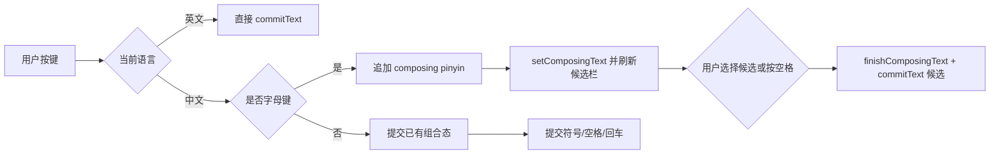

# V1 中文/英文输入技术路线

## 结论

V1 只支持中文和英文时，键位与 IME 前端先保持可运行，但中文候选质量不再继续依赖项目内自研小词库。当前 `PinyinEngine` 仅作为临时 fallback；正式中文输入能力应接入成熟离线引擎，首选 Rime/librime。

原因：

- 中文拼音输入必须有候选词引擎，不能只靠键盘布局直接生成汉字。
- 强制联网下载词库会增加首启复杂度，也会引入隐私和可用性问题。
- V1 的关键目标是把键位、组合态、候选栏、提交逻辑和中英切换跑通，并把中文引擎边界拆出来。
- 候选精度、用户词典、9 键拼音展开、候选分页应交给 Rime/librime 这类成熟离线引擎。

当前代码已经按这个路线实现：

- 默认中文模式。
- 点击字母先进入拼音组合态。
- 中文支持 26 键拼音和 9 键拼音。
- 9 键使用 T9 数字序列匹配拼音候选，`2=ABC`、`3=DEF`、`4=GHI`、`5=JKL`、`6=MNO`、`7=PQRS`、`8=TUV`、`9=WXYZ`。
- 候选栏显示拼音和候选词。
- 点候选或空格提交首候选。
- 键盘主体左二固定为 Emoji 入口。
- 键盘下方辅助行左侧地球仪负责输入模式切换：中文 26 键、中文 9 键、英文依次循环。
- 键盘下方辅助行右侧麦克风保留语音入口；纯离线 V1 不调用系统联网语音识别。
- 英文模式保留 Shift、Caps Lock、空格双击句号等逻辑。
- 词库位于 `app/src/main/assets/pinyin_zh.tsv`，完全离线、可审计。

## Android IME 基础逻辑

Android 官方文档把输入法定义为包含 `InputMethodService` 的应用。输入法通过 manifest 声明 `android.view.InputMethod` 服务和 `BIND_INPUT_METHOD` 权限，再由 `onCreateInputView()` 返回键盘 UI。

输入到目标 App 时，官方建议正常输入法使用 `InputConnection.commitText()` 这一类 API 提交文本，而不是依赖原始 key event。候选栏可以作为 IME UI 的一部分实现，也可以通过 candidates view 管理。

本项目对应关系：

- `KeyboardImeService`：IME 生命周期、输入提交、中文组合态。
- `IosKeyboardView`：键盘绘制和触摸。
- `CandidateStripView`：候选栏。
- `ChineseInputEngine`：中文输入引擎边界。
- `LegacyPinyinInputEngine`：当前 APK 的临时 fallback，内部仍使用小型 TSV 词库。
- `PinyinEngine`：旧的 TSV 查询实现，不再作为长期主方案。

## 中文输入为什么需要词典

拼音到汉字是一对多映射。例如 `shi` 可以是“是、时、事、市、十、师”等。没有词典或语言模型，就只能把 `shi` 当英文字符提交，无法自然输入中文。

当前 fallback 的词典策略：

- 内置一个小型 TSV 词库，用来验证输入链路。
- 词库随 APK 打包，不联网、不下载。
- TSV 第一列是拼音，第二列是候选词，候选词按空格分隔。
- 后续不通过继续扩写 TSV 作为主路线，而是接入成熟离线引擎。

V1 不做：

- 云候选。
- 自动上传输入内容。
- 首启下载词库。
- 复杂分词和神经语言模型。

## 后续可接入的成熟方案

### Rime / librime

Rime 是成熟的跨平台中文输入法引擎，核心库是 C++，支持拼音、形码、方言方案、YAML 输入方案、OpenCC 转换等。官方 README 说明它是模块化、可扩展的输入法引擎，并列出 Android 前端如 Trime、fcitx5-android。

当前 Android 方案使用 `librime` 作为离线输入引擎，但不直接使用雾凇拼音的完整 schema，因为完整雾凇方案依赖 Lua 插件。项目保留自己的 `openphone_pinyin` 和 `openphone_t9` schema，只把主词库切换到雾凇拼音 `rime_ice`，以改善简体中文候选质量，同时继续保持现有九宫格 UI 和 iOS 风格操作逻辑。

优点：

- 中文输入能力成熟。
- 方案生态强，可支持全拼、双拼、五笔等。
- 有现成开源 Android 前端可参考。

代价：

- 需要 JNI/NDK 集成。
- 包体、构建链、配置管理复杂度明显上升。
- 要处理词库、用户数据目录和 schema 部署。

### Fcitx5 Android / libime

Fcitx5 Android 已经把 Fcitx5 框架和多个引擎移植到 Android，并支持中文拼音、双拼、五笔、仓颉等。它适合作为架构参考或未来引擎接入方向。

代价与 Rime 类似：能力强，但集成复杂，V1 不宜一开始就把 UI 键位校准和大型输入引擎同时做。

更详细的调研与接入决策见 [中文输入引擎调研与接入决策](CHINESE_INPUT_ENGINE_RESEARCH.zh-CN.md)。

### OpenCC

OpenCC 适合后续做简繁转换和地区词汇转换。它不是拼音输入引擎，不能单独解决拼音转汉字，但可以接在候选输出之后。

## V1 输入状态机

## 参考资料

- Android Developers: [Create an input method](https://developer.android.google.cn/develop/ui/views/touch-and-input/creating-input-method?hl=en)
- Android Developers: [InputMethodService](https://developer.android.com/reference/android/inputmethodservice/InputMethodService)
- Rime: [librime](https://github.com/rime/librime)
- Rime: [plum schema and dictionary packages](https://github.com/rime/plum)
- Fcitx5 Android: [fcitx5-android](https://github.com/fcitx5-android/fcitx5-android)
- OpenCC: [Open Chinese Convert](https://github.com/BYVoid/OpenCC)
